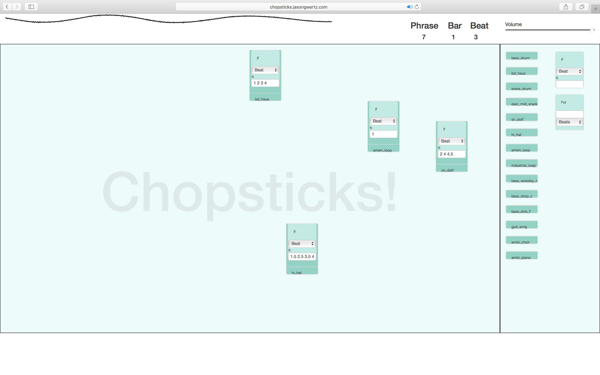

# Chopsticks!

## About

"Chopsticks!" is a graphical programming language for live coding music, running entirely in the browser. Inspired by Scratch, Sonic Pi, ChucK, and the reacTable, you can use "Chopsticks!" to combine samples and make complex beats or entire songs. Schedule when the audio samples will play using "if" conditionals and "for" loops, and rearrange nodes on the canvas to change gain and filter.

## Building and Deploying

The source code of "Chopsticks!" is almost entirely written in [CoffeeScript](http://coffeescript.org), an easy-to-read language that compiles directly to JavaScript. Once you have CoffeeScript installed, you can compile the source files in /src and send the output to /static/js using `coffee -bc -o chopsticks/static/js/ chopsticks/src/` ("Chopsticks!" uses the "bare" feature of the CoffeeScript compiler, which removes the top-level safety wrapper). If you want the CoffeScript compiler to watch the source folder for changes and compile automatically, add a `-w` flag, as in: `coffee -bcw -o chopsticks/static/js/ chopsticks/src/`.

There is no backend component to "Chopsticks!", so simply load the `index.html` in your browser or deploy it using a webserver like Apache. All dependencies (jQuery, jQuery UI, Touch-Punch, and Bootstrap) are included in the repository under /static/lib.

## Contributing

Any contributions to "Chopsticks!" are welcome! Please send all pull requests, or message me (Jason) by email or Twitter with questions. Front-end developers or designers that can contribute to the visual interface are especially appreciated!

For ideas on where to contribute, see the Road Map file. To learn about the code style guidelines for this project, see the Code Style file.